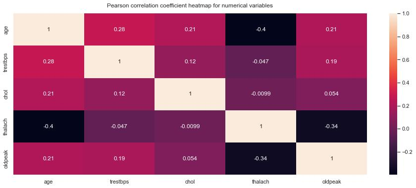
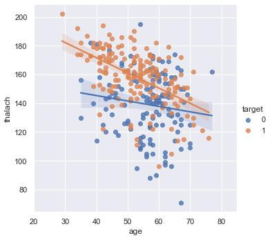
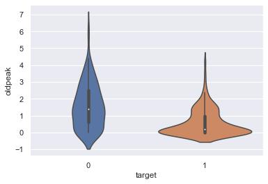
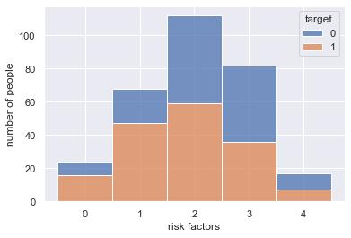
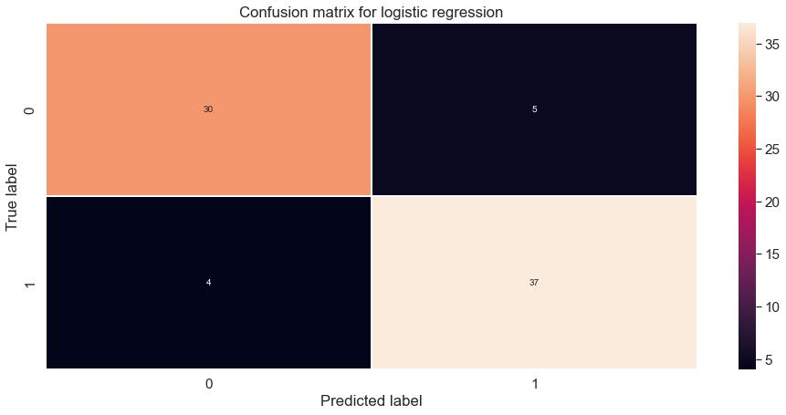
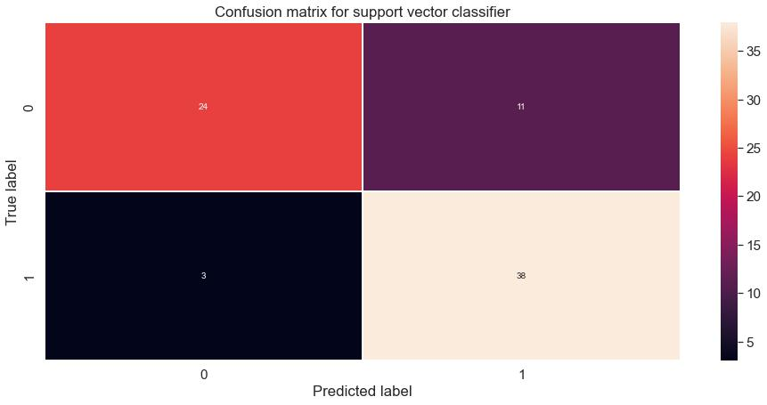
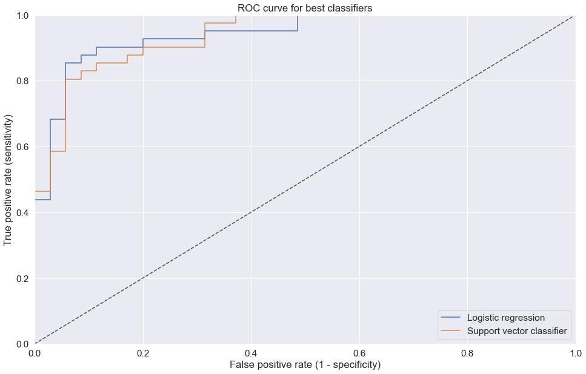
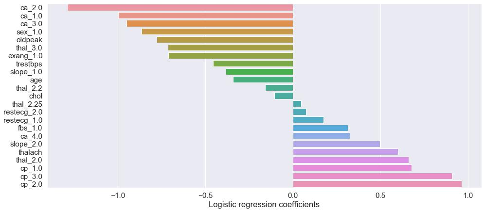
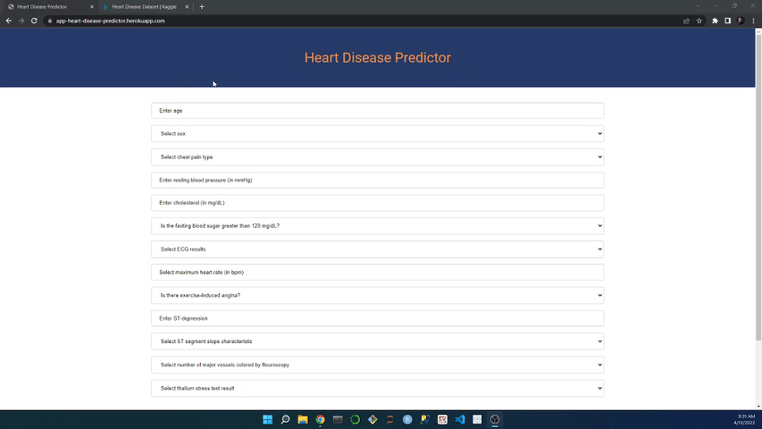

# Predicting Heart Disease in Patients with Angina

This repository is for the analysis and modeling done with the UCI heart disease dataset. Below you will find an overview of the data, code, and results.

### Project Outcome
Doctors diagnosing heart attacks (i.e., angina caused by heart disease) in angina patients have a [misdiagnosis rate of 33%](https://www.bbc.com/news/health-37215768). This translates to a recall score of 66%. Moreover, the [accuracy of doctors diagnosing heart disease using heart scans is 83%](https://www.bbc.com/news/health-42357257). Using these as recall and accuracy thresholds to be above, the test set recall score for my best model was 90% with an accuracy of 88%. Therefore, the project was a sucess. I productionized the best performing model with a [front-end](https://app-heart-disease-predictor.herokuapp.com/) to help doctors with diagnosing heart attack patients.

### Code Used 

**Python Version:** 3.7.10 <br />
**Packages:** pandas, numpy, scipy, sklearn, matplotlib, seaborn, flask, statsmodels, pickle<br />
**For Web Framework Requirements:**  ```pip install -r requirements.txt```  

## Heart Disease Dataset

The dataset was gathered from the [UCI Machine Learning Repository](https://archive.ics.uci.edu/ml/datasets/heart+disease). The dataset contains 14 variables and 303 patient records.

### Variables

`age`: age in years
`sex`: male (1) or female (0)
`cp`: type of chestpain: typical angina (1), atypical angina (2), non-anginal pain (3), and asymptomatic (4)
`trestbps`: resting blood pressure in mmHg
`chol`: cholesterol  in mg/dL
`fbs`: fasting blood sugar > 120 mg/dL: yes (1) or no (0)
`restecg`: resting electrocardiogram (ECG) results: normal (0), ST-T wave abnormality (1), or probable/definite left ventricular hypertrophy (2)
`thalach`: maximum heart rate
`exang`: exercise induced angina: yes (1) or no (0)
`oldpeak`: ST depression induced by exercise relative to rest
`slope`: slope of the peak exercise ST segment: upsloping (1), flat (2), or downsloping (3)
`ca`: number of major vessels colored by flouroscopy: 0, 1, 2, or 3
`thal`: thalassemia (blood disorder): normal (3), fixed defect (6), or reversible defect (7)
`target`: heart disease (1) or no heart disease (0)

## Files

### code/eda.py

This file contains the EDA and feature engineering. The EDA is performed using descriptive statistics, histograms to determine distributions, and a correlation heatmap using the Pearson correlation coefficient. A feature is engineered by creating a predictor based on risk factors. Other feature engineering includes the creation of dummy variables for categorical variables with OneHotEncoder and numerical features are scaled using MinMaxScaler. The encoder and scaler are pickled after fitting for use with productionization.

### code/modeling.py

This file contains the modeling where I hyperparameter tune: GaussianNB, LogisticRegression, DecisionTreeClassifier, kNeighborsClassifier, RandomForestClassifier, SVC (support vector classifier), XGBClassifier, StackingClassifier, and VotingClassifier. Since the computational needs are low from having 303 records with 12 features, I used nine ML algorithms and ensemble methods. The models are hyperparameter tuned with GridSearchCV based on accuracy and the best models are judged primarily on recall and accuracy, but other metrics such as AUC (ROC) were also examined.

### datasets/heart.csv

This file contains the heart data that was analyzed.

### deployment

This folder contains the pickle files for the logistic regression and SVC models, min max scaler, one hot encoder, and other files such as the HTML frontend and Flask files.

### output

This folder contains the jpg images generated from running the eda.py and modeling.py scripts.

## Results

### EDA

I looked at the distributions of the data and the correlations between variables. Below are some of the highlights. The target variable is distributed such that 54% of the samples have heart disease and 46% do not. This sets the accuarcy baseline for all model at 54% (to be better than random guessing).

<div align="center">
  
<figure>
<br/>
  <figcaption>Figure 1: Correlation heatmap for numerical variables using Pearson correlation coefficient</figcaption>
</figure>
<br/><br/>
  
</div>

<div align="center">
  
<figure>
<br/>
  <figcaption>Figure 2: Scatter plot with linear regression lines showing maximum heart rate decreases at a greater rate with age for those with heart disease.</figcaption>
</figure>
<br/><br/>
  
</div>

<div align="center">
  
<figure>
<br/>
  <figcaption>Figure 3: Violin plot showing lower oldpeak values for those with heart disease.</figcaption>
</figure>
<br/><br/>
  
</div>

<div align="center">
  
<figure>
<br/>
  <figcaption>Figure 4: Bar plot showing minimal relationship between number of risk factors and heart disease.</figcaption>
</figure>
<br/><br/>
  
</div>

### Feature Engineering

I feature engineered using the dataset for modeling. I created dummy variables for `sex`,`cp`, `fbs`, `restecg`, `exang`, `slope`, `ca`, `thal`.

### Model Building

First, I split the data into train and tests sets with a test set size of 25%.

I then hyperparameter tuned nine different models with ten-fold cross-validation and evaluated the results using recall and accuracy.

The models I used were GaussianNB, LogisticRegression, DecisionTreeClassifier, kNeighborsClassifier, RandomForestClassifier, SVC (support vector classifier), XGBClassifier, StackingClassifier, and VotingClassifier.

### Model Performance

For this application it's important to minimize false negatives (i.e., people who have heart disease but were predicted not to). For this reason, the most important metrics were recall and accuracy, but I also looked at AUC (ROC). The best model was:
<br/><br/>
**LogisticRegression**
* Recall/Sensitivity: 0.90
* Accuracy: 0.88
* AUC (ROC): 0.94

The SVC model scored better in recall (with a score of 0.93), but had a lower accuracy (with a score of 0.82) which is below the doctor diagnosis threshold.

<div align="center">
  
<figure>
<br/>
  <figcaption>Figure 5: Confusion matrix for logistic regression model.</figcaption>
</figure>
<br/><br/>
  
</div>

<div align="center">
  
<figure>
<br/>
  <figcaption>Figure 6: Confusion matrix for SVC.</figcaption>
</figure>
<br/><br/>
  
</div>

<div align="center">
  
<figure>
<br/>
  <figcaption>Figure 7: ROC for logistic regression and SVC models.</figcaption>
</figure>
<br/><br/>
  
</div>

### Feature Importance

According to the logistic regression coefficients in Figure 5, the most important features, in order, were `ca`, `cp`. `sex`, `oldpeak`, and `thal`, `fbs` and `chol` had low impact on the model which is against conventional wisdom that diabetes and high cholesterol increase the risk for heart disease. Although, this group of people are not representative of the general population, because the common trait of these patients is that they have all experienced angina. `thalach` ranks highly in feature importance, as shown in Figure 2, there is a definite difference between the heart disease groups. Interestingly, maximum heart rate converges for the two groups, so `thalach` is probably more useful to determine heart disease in younger patients than older.

<div align="center">
  
<figure>
<br/>
  <figcaption>Figure 8: Logistic regression coefficients.</figcaption>
</figure>
<br/><br/>
  
</div>

## Productionization

I built a [Heroku web app](https://app-heart-disease-predictor.herokuapp.com/) with a front end which takes patient medical information input from the user and outputs a heart disease prediction using the logistic regression model. Once the user has input their information and submitted, the model makes a prediction and outputs the probabilities of each class (i.e., heart disease and no heart disease). This was included for cases where the probabilities are close so that users do not heavily rely on the predictions and make diagnoses at their own discretion. 

<div align="center">
  
<figure>
<br/>
  <figcaption>Figure 9: Front-end of application using the logistic regression model.</figcaption>
</figure>
<br/><br/>
  
</div>

## Resources

1. [A third of heart attack patients misdiagnosed](https://www.bbc.com/news/health-37215768)
2. [Doctors have an 80% accuracy in diagnosis](https://www.bbc.com/news/health-42357257)
3. [UCI Machine Learning Repository (dataset)](https://archive.ics.uci.edu/ml/datasets/heart+disease)
4. [Kaggle: Ken Jee - Titanic Project Example](https://www.kaggle.com/kenjee/titanic-project-example)
5. [Machine Learning Mastery: Stacking Ensemble Machine Learning with Python](https://machinelearningmastery.com/stacking-ensemble-machine-learning-with-python/)
6. [Machine Learning Mastery: How to Report Classifier Performance with Confidence Intervals](https://machinelearningmastery.com/report-classifier-performance-confidence-intervals/)
7. [Medium: Evaluating a Random Forest Model](https://medium.com/analytics-vidhya/evaluating-a-random-forest-model-9d165595ad56)
8. [Analytics Vidhya: AUC-ROC Curve in Machine Learning Clearly Explained](https://www.analyticsvidhya.com/blog/2020/06/auc-roc-curve-machine-learning/)
9. [GitHub: asthasharma98/Heart-Disease-Prediction-Deployment](https://github.com/asthasharma98/Heart-Disease-Prediction-Deployment)
